<p align="center">
  
  
  
  
  
  
</p>

<h1 align="center">NexusOS</h1>

<p align="center"><b>A hybrid operating system built entirely from scratch — taking the best of Windows, macOS, and Linux, with none of the bloat.</b></p>

<p align="center"><i>No GRUB. No Linux kernel. No third-party bootloader. Just raw metal.</i></p>

---

NexusOS is a bare-metal x86 operating system written in C and x86 Assembly. It boots from a custom 2-stage bootloader, initializes VESA graphics at 1024×768×32bpp, sets up full virtual memory with paging, launches a windowed desktop environment with 30+ built-in applications, provides a complete TCP/IP networking stack with a web browser, implements POSIX/X11 compatibility layers, supports ELF dynamic linking with shared libraries, includes a PE32 loader for Windows executables, ships a package manager with its own `.npk` archive format, CRC32 integrity checking, and recursive dependency resolution, embeds a scripting engine (NexusScript) for OS automation, provides a macOS compatibility shim with a Mach-O loader and a Cocoa/Core Foundation API subset, drives real sound hardware through an Intel AC'97 audio driver with a software mixer and WAV player, decodes BMP/PNG/JPEG/GIF images (with a from-scratch DEFLATE inflater, baseline-JPEG IDCT, and LZW) shown in a fullscreen viewer, and plays Motion-JPEG `.avi` video with synchronized PCM audio through its own RIFF/AVI parser and media player — all in under 1 MB of kernel code running on 16 MB of RAM.

---

## Table of Contents

- [Screenshots](#-screenshots)
- [Feature Highlights](#-feature-highlights)
- [Architecture Overview](#-architecture-overview)
- [Subsystem Deep Dive](#-subsystem-deep-dive)
- [Built-in Applications](#-built-in-applications-30)
- [Shell Commands](#-shell-commands-93-total)
- [Desktop GUI](#-desktop-gui)
- [Project Structure](#-project-structure)
- [Build & Run](#-build--run)
- [Boot Flow](#-boot-flow)
- [Roadmap](#-roadmap)
- [Growth Projection](#-growth-projection)

---

## 📸 Screenshots

<p align="center">
  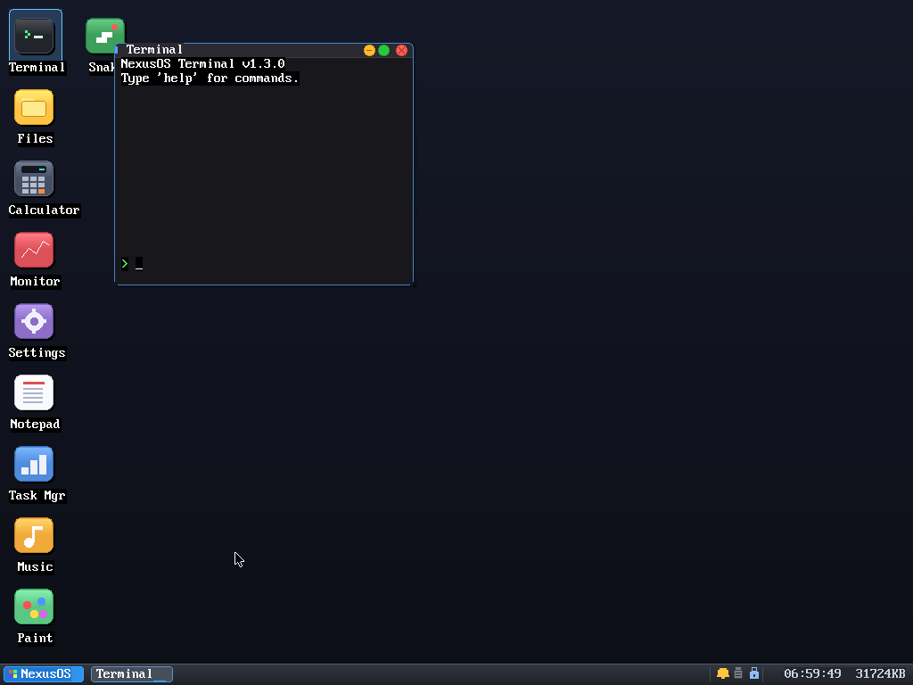
  <br>
  <sub><b>The VESA desktop</b> (1024×768×32bpp) — window manager, taskbar, dock, and 30+ built-in apps</sub>
</p>

<table>
  <tr>
    <td width="50%" align="center">
      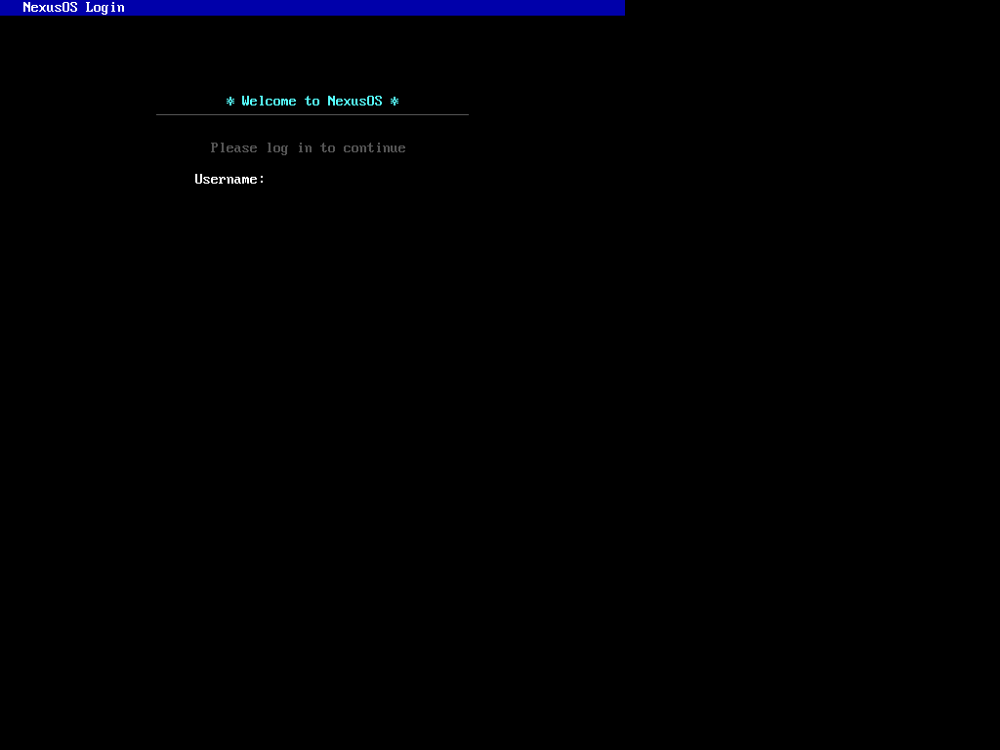
      <br><sub><b>Boot login screen</b></sub>
    </td>
    <td width="50%" align="center">
      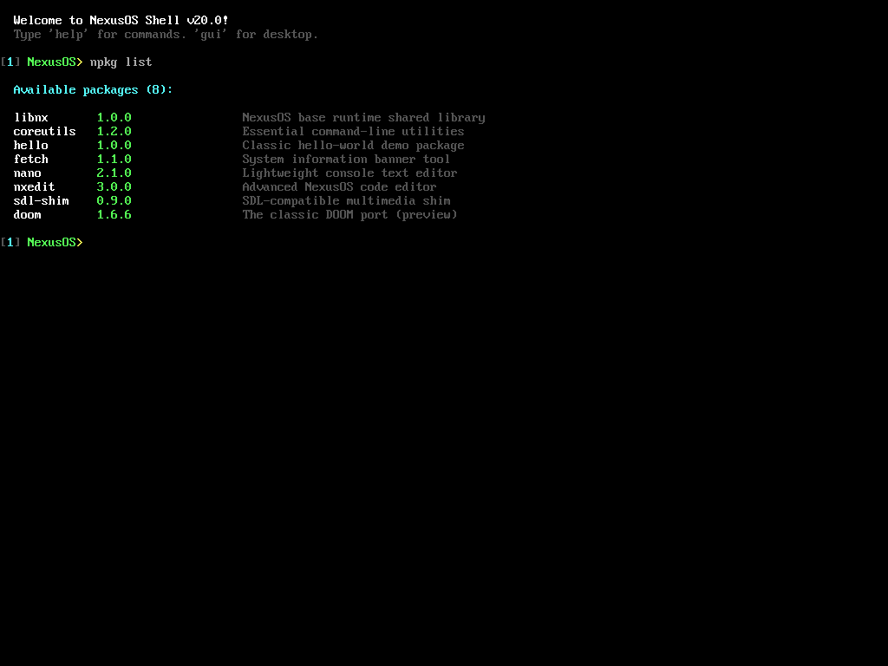
      <br><sub><b>Package manager</b> — <code>npkg list</code></sub>
    </td>
  </tr>
  <tr>
    <td width="50%" align="center">
      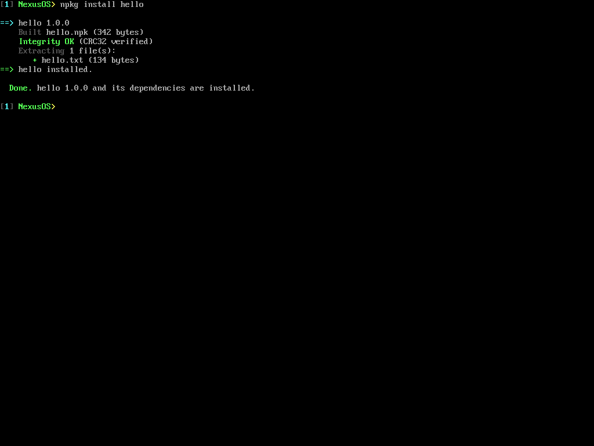
      <br><sub><b>Installing a package</b> — <code>.npk</code> build, CRC32 verify, extract</sub>
    </td>
    <td width="50%" align="center">
      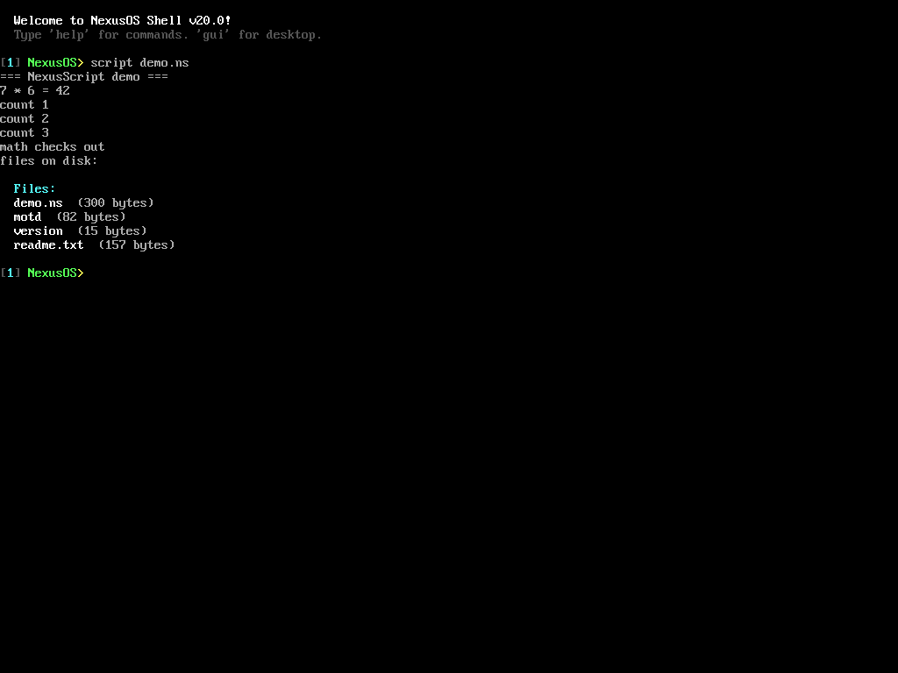
      <br><sub><b>Scripting engine</b> — <code>script demo.ns</code> (loops, conditionals, <code>run</code>)</sub>
    </td>
  </tr>
  <tr>
    <td width="50%" align="center">
      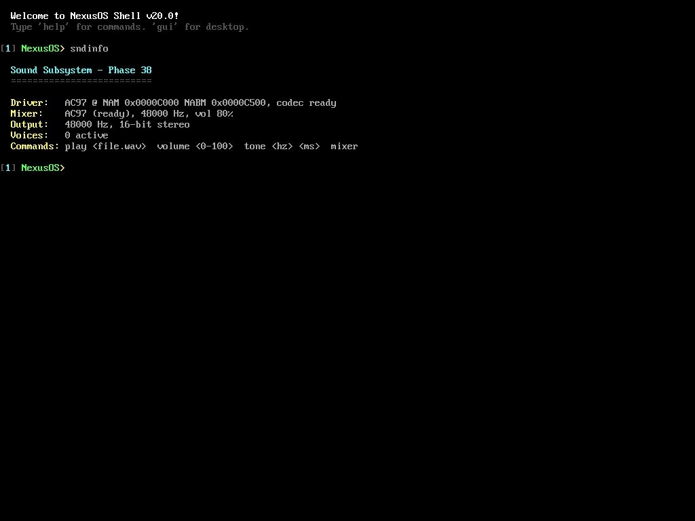
      <br><sub><b>Sound subsystem</b> — <code>sndinfo</code> (Intel AC'97 codec, mixer, WAV player)</sub>
    </td>
    <td width="50%" align="center">
      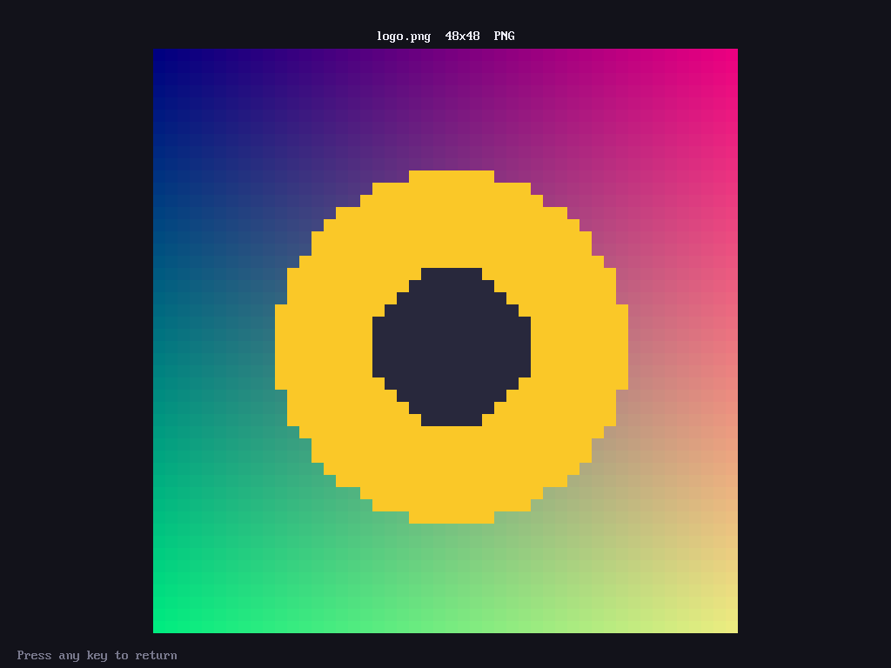
      <br><sub><b>Image viewer</b> — <code>view logo.png</code> (BMP/PNG/JPEG/GIF decoders)</sub>
    </td>
  </tr>
  <tr>
    <td width="50%" align="center">
      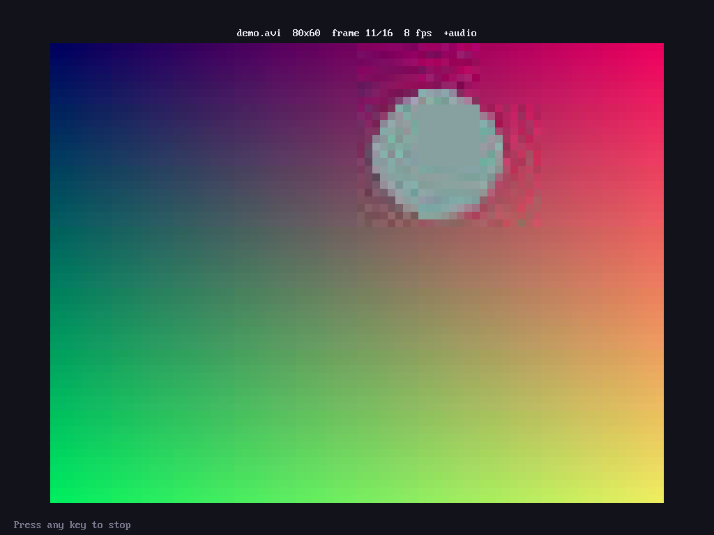
      <br><sub><b>Media player</b> — <code>mplay</code> (RIFF/AVI parser, MJPEG video + synced audio)</sub>
    </td>
    <td width="50%" align="center">
      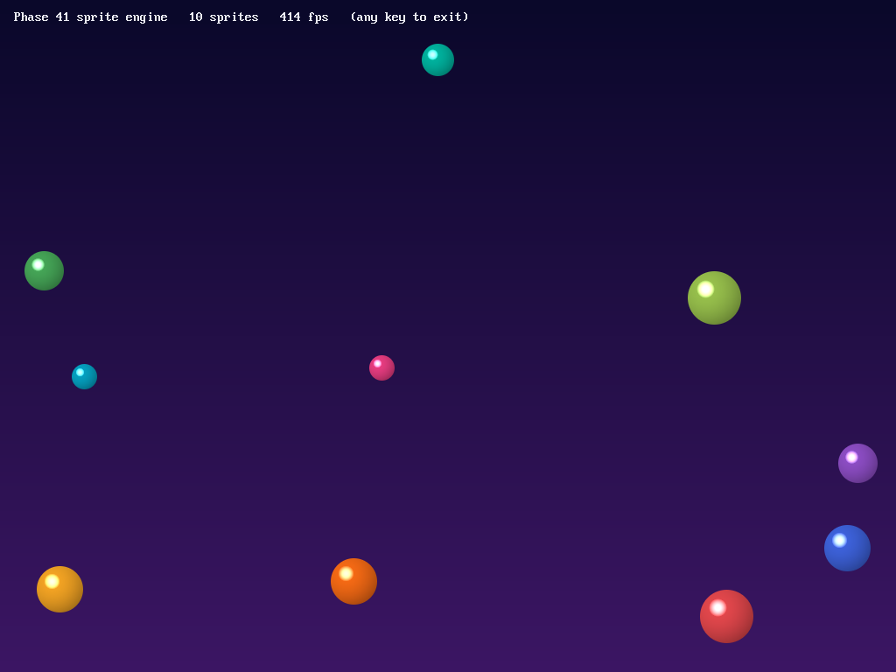
      <br><sub><b>Sprite engine</b> — <code>sprites</code> (VirtIO-GPU zero-copy presents, ~520 fps)</sub>
    </td>
  </tr>
  <tr>
    <td width="50%" align="center">
      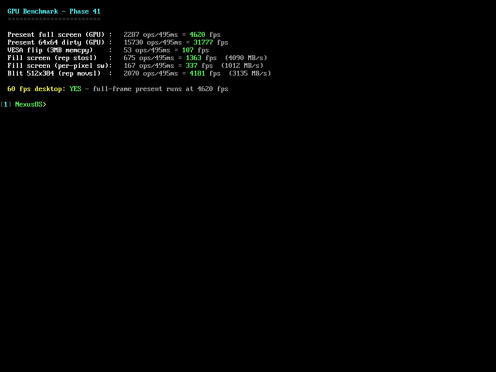
      <br><sub><b>GPU benchmark</b> — <code>gpubench</code> (4620 fps GPU present vs 107 fps VESA memcpy)</sub>
    </td>
    <td width="50%" align="center">
      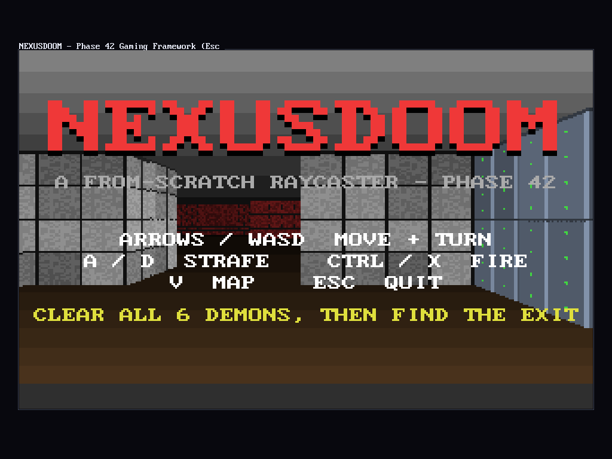
      <br><sub><b>NEXUSDOOM</b> — <code>doom</code> (from-scratch raycaster on the NexusSDL gaming framework)</sub>
    </td>
  </tr>
  <tr>
    <td width="50%" align="center">
      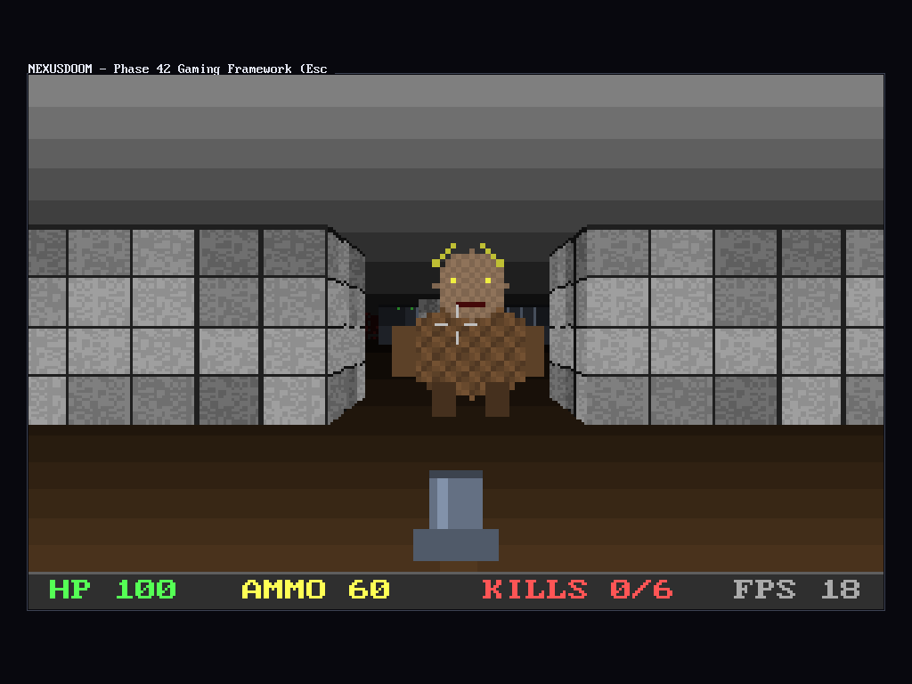
      <br><sub><b>NEXUSDOOM gameplay</b> — textured DDA raycaster, z-tested demon sprites, hitscan + HUD</sub>
    </td>
    <td width="50%" align="center">
      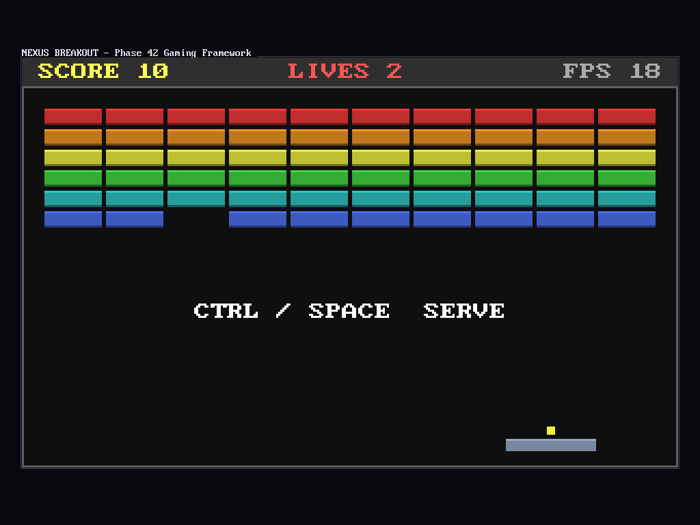
      <br><sub><b>Breakout</b> — <code>breakout</code> (Q16.16 ball physics, paddle english, ~200-line NexusSDL demo)</sub>
    </td>
  </tr>
  <tr>
    <td width="50%" align="center">
      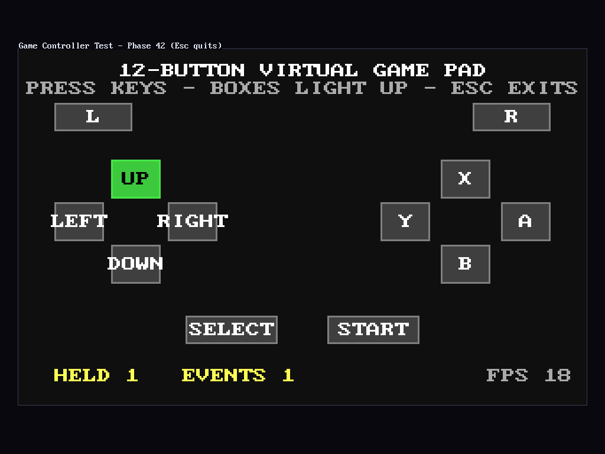
      <br><sub><b>Controller tester</b> — <code>gamepad</code> (12-button virtual pad from raw PS/2 scancodes)</sub>
    </td>
    <td width="50%" align="center">
      &nbsp;
    </td>
  </tr>
</table>

---

## ✨ Feature Highlights

### 🖥️ Desktop Environment
- **VESA VBE 2.0 Graphics** — 1024×768 resolution, 32-bit color depth, linear framebuffer, double-buffered rendering
- **Window Manager** — Up to 8 overlapping windows with pixel-perfect borders, rounded corners (6px radius), drop shadows (4px), gradient titlebars
- **Window Controls** — Drag, resize (8 directions), minimize, maximize, restore, close with animations
- **Window Snapping** — Snap windows to left/right half of screen
- **Desktop Shell** — Login screen with animated splash, desktop icons, high-res wallpapers (BMP), right-click context menus, notification toasts
- **Taskbar** — App launcher, running window list, system tray with clock, lock button, notification center
- **Start Menu** — Categorized app launcher with keyboard navigation
- **Application Dock** — Quick-launch dock bar
- **Command Palette** — Quick command search (Ctrl+P)
- **Window Switcher** — Alt+Tab style cycling through open windows
- **Virtual Workspaces** — 4 virtual desktops (Ctrl+F5 through Ctrl+F8)
- **Screensaver** — Auto-activating after 60 seconds of idle
- **Lock Screen** — Secure lock with password prompt
- **Notification Center** — Scrollable notification history
- **Clipboard Manager** — Clipboard history with paste support (Ctrl+V)
- **System Logger** — Persistent activity log
- **Power Menu** — Shutdown, restart, lock options
- **4 Themes** — Dark (cyan/black), Light (blue/white), Retro (green/black), Ocean (blue tones)
- **Theme Engine** — Full color palette system with appearance settings
- **Keyboard Shortcuts Overlay** — F1 to view all shortcuts
- **Widget System** — Desktop widgets toggle (Ctrl+I)
- **Custom Cursor** — 18×12 pixel cursor bitmap rendered in VESA mode

### 🌐 Networking Stack
- **RTL8139 NIC Driver** — PCI-based Ethernet driver with full TX/RX, MAC addressing, link status, packet statistics
- **ARP** — Address Resolution Protocol with aging cache
- **IPv4** — Internet Protocol with header construction, validation, routing
- **ICMP** — Ping send/receive with RTT measurement, statistics
- **UDP** — User Datagram Protocol with port binding, callbacks
- **TCP** — Full TCP with 3-way handshake, sequence numbers, windowing, retransmission, state machine (LISTEN→SYN_SENT→ESTABLISHED→FIN_WAIT→CLOSED)
- **BSD Socket API** — socket(), bind(), listen(), accept(), connect(), send(), recv()
- **DNS Resolver** — Query construction, response parsing, domain-to-IP resolution
- **HTTP/1.1 Client** — GET requests, response parsing, header extraction, body download
- **HTML Parser** — Tag parsing (p, h1-h6, a, ul, li, pre, br), link extraction
- **Web Browser** — URL navigation, link clicking, page history, bookmarks
- **DHCP Client** — Discover→Offer→Request→Ack, auto IP/gateway/DNS configuration
- **NTP Client** — Time synchronization with NTP servers
- **HTTP Server** — Serves pages on port 8080 with start/stop control
- **Remote Shell** — Telnet-style remote access on port 2323

### 🔧 Compatibility Layers
- **POSIX Compatibility** — `open`/`read`/`write`/`close`/`fork`/`exec` syscall translation, signal handling (SIGTERM, SIGKILL, SIGSTOP), job control
- **procfs** — `/proc/cpuinfo`, `/proc/meminfo`, `/proc/uptime`, `/proc/version`, `/proc/status`, `/proc/mounts`
- **termios** — Terminal I/O control for Unix-style terminal behavior
- **Environment Variables** — `PATH`, `HOME`, `USER`, `SHELL`, `TERM`, `PWD` with `export KEY=VALUE`
- **ELF32 Binary Loader** — Load and execute ELF32 binaries in ring-3 userspace
- **ELF Dynamic Linking** — Shared libraries (.so), dynamic linker, `dlopen`/`dlsym`/`dlclose` API
- **Built-in libc** — 26+ symbols: `printf`, `malloc`, `free`, `memcpy`, `memset`, `strcmp`, `strlen`, `fopen`, `fread`, `fwrite`, `fclose`, etc.
- **X11 Compatibility Shim** — X11R6 protocol mapped to NexusOS window manager:
  - Display: `XOpenDisplay`, `XCloseDisplay`, `XDefaultScreen`, `XDisplayWidth/Height`
  - Windows: `XCreateSimpleWindow`, `XDestroyWindow`, `XMapWindow`, `XUnmapWindow`, `XMoveWindow`, `XResizeWindow`, `XRaiseWindow`, `XStoreName`
  - Drawing: `XDrawPoint`, `XDrawLine`, `XDrawRectangle`, `XFillRectangle`, `XDrawArc`, `XFillArc`, `XDrawString`, `XClearArea`
  - Events: `XSelectInput`, `XNextEvent`, `XPending`, `XCheckMaskEvent`
  - GC: `XCreateGC`, `XFreeGC`, `XSetForeground`, `XSetBackground`, `XSetLineAttributes`
  - Atoms: `XInternAtom`, `XGetAtomName`
  - Misc: `XFlush`, `XSync`, `XBell`
  - Supports 16 X11 windows, 32 GCs, 8 pixmaps, 64 atoms, 32-event queue
- **Win32 Compatibility Layer** — Full PE32 loader + Win32 API shim:
  - **PE32 Loader** — DOS MZ header validation, PE signature parsing, i386 section loading (.text/.data/.bss), import table resolution, ring-3 userspace execution
  - **kernel32.dll** — `GetModuleHandle`, `ExitProcess`, `CreateFileA`, `ReadFile`, `WriteFile`, `CloseHandle`, `GetFileSize`, `HeapAlloc`, `HeapFree`, `Sleep`, `GetTickCount`, `GetCommandLineA`, `OutputDebugStringA`
  - **user32.dll** — `RegisterClassA`, `CreateWindowExA`, `ShowWindow`, `UpdateWindow`, `GetMessageA`, `TranslateMessage`, `DispatchMessageA`, `PostQuitMessage`, `DefWindowProcA`, `MessageBoxA`, `DestroyWindow`, `BeginPaint`, `EndPaint`, `GetDC`, `ReleaseDC`
  - **gdi32.dll** — `TextOutA`, `SetBkColor`, `SetTextColor`, `GetStockObject`, `SelectObject`, `CreateSolidBrush`, `DeleteObject`, `FillRect`, `Rectangle`, `MoveToEx`, `LineTo`, `SetPixel`
  - **advapi32.dll** — `RegOpenKeyExA`, `RegCreateKeyExA`, `RegCloseKey`, `RegQueryValueExA`, `RegSetValueExA`
  - **Registry Emulation** — In-memory flat key-value store, `HKEY_LOCAL_MACHINE`/`HKEY_CURRENT_USER`/`HKEY_CLASSES_ROOT`, pre-populated Windows version keys
  - **Import Resolver** — `win32_resolve_import()` dynamically binds PE imports to shim functions
  - 47 Win32 API functions shimmed, 16 windows, 8 classes, 32 handles, 64-event message queue

### 📦 Package Manager
- **`.npk` Archive Format** — Binary NexusOS Package: fixed header (magic `NPK1`, name/version/description/author, dependency + file tables) followed by a concatenated payload section
- **CRC32 Integrity** — A header CRC covers the entire archive body, and every payload file carries its own CRC32 — a corrupt download is rejected *before* anything is written to disk
- **Bundled Repository** — 8 curated packages (`libnx`, `coreutils`, `hello`, `fetch`, `nano`, `nxedit`, `sdl-shim`, `doom`) with a real dependency graph
- **Recursive Dependency Resolution** — Depth-first, dependencies installed first, with cycle detection, deduplication, and minimum-version checking (`>=`)
- **Install Pipeline** — `serialize → CRC verify → extract to VFS → register` with all-or-nothing rollback on filesystem failure
- **Installed Database** — Tracks each installed package's version, files, and on-disk size so `npkg remove` cleans up precisely (leaving shared dependencies intact)
- **Remote Mirror Probe** — `npkg update` does a best-effort HTTP reach of the configured mirror, falling back to the bundled local mirror
- **CLI** — `npkg list / search / info / install / remove / installed / update`

### 📜 Scripting Engine (NexusScript)
- **Real Interpreter** — lexer → token stream → recursive-descent evaluator walked by a token cursor (no external dependencies, fully in-kernel)
- **Language** — integer + string values, variables (`let`/reassignment), `if/elif/else/end`, `while/do/end`, `print`, and comments (`#`)
- **Expressions** — `+ - * / %`, comparisons `== != < <= > >=`, logical `and / or / not`, parentheses, string concatenation with `+`
- **Builtins** — `len(x)`, `str(x)`, `abs(x)`
- **OS Automation** — `run "<command>"` executes any shell command line from within a script, enabling macros and batch tasks
- **Safe by Design** — every statement and loop iteration draws from a step budget, so a runaway script can never hang the kernel; recursion and nesting are also bounded
- **CLI** — `script <file.ns>` (a sample `demo.ns` is installed at boot)

### 🍎 macOS Compatibility Shim
- **Mach-O Loader** — Parses 32-bit i386 Mach-O executables: validates the header (`MH_MAGIC`, `CPU_TYPE_X86`, `MH_EXECUTE`), walks the load commands (`LC_SEGMENT`, `LC_UNIXTHREAD`/`LC_MAIN`, `LC_LOAD_DYLIB`), maps segments (skipping `__PAGEZERO`), resolves the entry point, and transitions to ring-3
- **Core Foundation** — Reference-counted object model (`CFRetain`/`CFRelease`/`CFGetRetainCount`) over a fixed pool: `CFStringCreateWithCString`, `CFStringGetCStringPtr`, `CFNumberCreate`/`CFNumberGetValue`, `CFGetTypeID`, `CFShow`
- **Cocoa / AppKit** — `NSWindow` bridged to the NexusOS window manager (create / order-front / close), `NSString`, `NSLog`; a released `NSWindow` tears down its underlying window
- **CLI** — `machoinfo` (subsystem status), `runmacho <file>` (load a Mach-O), `cocoademo` (build CF objects + a live NSWindow on the desktop)

### 🔊 Sound (Era 5 — Multimedia)
- **Intel AC'97 Driver** — Real driver for the Intel 82801AA AC'97 controller (PCI `8086:2415`, class `04:01`): probes the PCI bus, enables bus-master DMA, brings the controller out of cold reset, resets the codec, and waits for the primary codec to report ready
- **Bus-Master PCM-out** — Streams 16-bit PCM through the NABM engine using a **Buffer Descriptor List**; reads the mixer (NAM) and bus-master (NABM) I/O windows straight from the device's two PCI BARs, with poll-to-completion playback bounded by a tick timeout + spin cap so a wedged engine can never hang the kernel
- **Software Mixer** — Blends up to **8 simultaneous PCM voices** into one 16-bit stereo stream, with per-voice + master volume (0–100), mono→stereo up-mix, and nearest-neighbour resampling to the device rate (sources at any rate play correctly)
- **WAV Player** — Parses RIFF/WAVE files (8- and 16-bit PCM, mono/stereo), borrowing 16-bit samples in place and converting 8-bit on the fly; a `startup.wav` chime is generated and installed in the filesystem at boot
- **Tone Generator** — Integer-only sine synthesis (Bhaskara approximation + Q16 phase accumulator — no FPU, no libm) with small looping waveform buffers for arbitrary frequencies
- **Device-Agnostic Core** — The mixer/WAV layer (`audio.c`) sits above a small sound-device interface; AC'97 (`ac97.c`) registers itself as the active sink, and a timed null-sink fallback keeps the commands working when no codec is present
- **CLI** — `sndinfo` (status), `play <file.wav>`, `volume <0-100>`, `tone <hz> <ms>`, `mixer` (3-voice C-E-G chord demo)

### 🖼️ Image Formats (Era 5 — Multimedia)
- **BMP** — Uncompressed 24/32-bit, top-down and bottom-up scanline order
- **PNG** — A from-scratch **DEFLATE/zlib inflater** (stored + fixed + dynamic Huffman) plus all five scanline filters (none/sub/up/avg/paeth); supports 8-bit grayscale, RGB, palette, gray+alpha and RGBA
- **JPEG** — A **baseline sequential** decoder: DQT/DHT/SOF0/DRI/SOS parsing, canonical Huffman decode, dequantization, an integer **IDCT**, chroma upsampling for any sampling factor, and YCbCr→RGB
- **GIF** — GIF87a/89a with **LZW** decompression, global/local colour tables, interlacing, transparency, and **animated multi-frame** playback with disposal
- **Unified Pipeline** — Magic-byte format detection → per-format decoder → 32-bit ARGB buffer; integer-only math throughout (no FPU, no libm, no 64-bit division)
- **Fullscreen Viewer** — Scales each image to fit 1024×768 with a caption; animated GIFs cycle their frames until a key is pressed. A `startup.wav`-style set of sample images (`icon.bmp`, `logo.png`, `photo.jpg`, `anim.gif`) is installed at boot
- **CLI** — `imginfo` (decode every sample + report format/size/centre pixel), `view <file>` (open any image fullscreen)

### 🎬 Video Playback (Era 5 — Multimedia)
- **RIFF/AVI Parser** — Walks the AVI container: `hdrl` (main `avih` header + per-stream `strh`/`strf`) and the `movi` chunk list (`NNdc`/`NNdb` video, `NNwb` audio), with no dependency on the `idx1` index
- **Motion-JPEG Video** — Each frame is a full JPEG decoded through the Phase 39 baseline decoder, then rendered scaled-to-fit on the framebuffer with a live frame counter
- **Synchronized Audio** — The PCM audio stream is concatenated and played through the Phase 38 AC'97 mixer; **video is paced off the audio clock** (one frame's worth of samples per video frame) so picture and sound stay aligned, with a tick-paced fallback for silent clips
- **Media Player** — Fullscreen playback with caption (`name WxH frame N/total fps +audio`); press any key to stop. A bundled `demo.avi` (80×60, 16 frames, 8 fps, 8 kHz audio) is embedded in the kernel
- **CLI** — `vidinfo [file]` (parse + report dimensions, frame count, fps, codec, audio format), `mplay [file]` (play; no arg = the bundled demo)

### 🖥️ GPU Acceleration (Era 5 — Multimedia)
- **VirtIO Transport** — A from-scratch **VirtIO 1.0 modern PCI transport**: walks the PCI capability list for the vendor config structures (common/notify/ISR/device), identity-maps the MMIO windows, negotiates `VERSION_1`, and drives **split virtqueues** in polled mode (tick timeout + spin cap, INTx disabled — no IRQs needed)
- **VirtIO-GPU Driver** — Probes PCI `1AF4:1050` (QEMU `-device virtio-vga`), then takes over the display: `GET_DISPLAY_INFO` → `RESOURCE_CREATE_2D` (B8G8R8X8) → `ATTACH_BACKING` → `SET_SCANOUT`; once the scanout flips, the VGA-compat output is retired and the driver owns presentation
- **Zero-Copy Presents** — The scanout resource is backed **directly by the kernel back buffer**, so presenting a frame is a single `TRANSFER_TO_HOST_2D` + `RESOURCE_FLUSH` pair instead of a 3 MB memcpy — **4,620 fps full-frame vs 107 fps for the legacy VESA flip (43× faster)**, and dirty-rectangle presents hit 31,000+ fps
- **Accelerated 2D** — `rep stosl`/`rep movsl` fill and blit primitives on the back buffer (4 GB/s fills — 4× the per-pixel path; 3.1 GB/s blits with overlap-safe copies)
- **Sprite Engine** — Up to 32 ARGB sprites with **per-pixel alpha blending**, z-ordering, show/hide and clipping, composited each frame; the bundled demo animates 10 shaded, anti-aliased balls over a gradient at **~520 fps**
- **Transparent Fallback** — `fb_flip()` routes through the GPU when the scanout is active and falls back to the VESA memcpy otherwise; the whole desktop renders identically with or without the device
- **CLI** — `gpuinfo` (transport, scanout, features, present count), `gpubench` (present/fill/blit benchmark), `sprites` (animated sprite demo)

### 🎮 Gaming Framework (Era 5 — Multimedia)
- **NexusSDL** — An SDL-like game API for the bare-metal kernel: open a **256-color palettized surface** (up to 320×240), draw with pixels/lines/rects/circles/sprites/scaled text, and present — the framework palette-expands and **integer-scales the surface to 1024×768** through the VirtIO-GPU dirty-rect present path (VESA flip fallback)
- **Fixed-Point Math Kit** — Q16.16 multiply/divide (single widening `imull` / inline `idivl` — no libgcc, no FPU), LUT sine/cosine on a 1024-unit circle (Bhaskara approximation), integer sqrt — everything a game sim needs in a freestanding kernel
- **Virtual Game Controller** — A raw-scancode hook in the PS/2 driver feeds a **12-button virtual pad** (D-pad, A/B/X/Y, L/R, Start/Select) with held-state, edge detection, and an SDL-style event queue; games *acquire* the pad (keys stop reaching the console) and *release* it on exit
- **Tick-Locked Timing** — Frames sync to the PIT tick (~18 fps, 55 ms) for deterministic simulation, with frame/fps/ms counters and non-blocking PC-speaker sfx
- **NEXUSDOOM** — A from-scratch **textured raycaster FPS**: one DDA walk per screen column with a per-column depth buffer, procedural 64×64 wall textures, **z-tested billboard demons** that chase and melee, hitscan pistol, HUD, minimap, and title/play/dead/victory states — clear all 6 demons, then find the glowing EXIT door
- **Breakout** — A second, ~200-line API demo: 6×10 brick wall, Q16 ball physics with paddle english, lives and scoring
- **CLI** — `gameinfo` (framework + pad map), `gamepad` (visual 12-button controller tester), `doom`, `breakout`

### 🧠 Core Kernel
- **Custom 2-Stage Bootloader** — Stage 1 (512-byte MBR at 0x7C00): loads stage 2 via BIOS INT 0x13. Stage 2: sets up VESA VBE mode, then **high-loads the kernel to 1 MB** — BIOS-reads 32 KB chunks into a low bounce buffer and copies each up during brief protected-mode hops (lifts the old 576 KB real-mode ceiling; kernel can now grow to ~720 KB), then switches to 32-bit Protected Mode
- **GDT** — Global Descriptor Table with kernel/user code and data segments
- **IDT** — Interrupt Descriptor Table with 256 entries, CPU exception handlers (ISR 0–31), hardware interrupt stubs (IRQ 0–15)
- **PIC** — 8259 Programmable Interrupt Controller, remapped to IRQ 32–47
- **Timer** — IRQ0 at ~18.2 Hz driving system tick counter, scheduler, status bar updates
- **Physical Memory Manager** — Bitmap-based page allocator for 4 KB pages across 16 MB RAM
- **Paging** — Page directory + page tables, identity-mapped kernel, VESA framebuffer mapping
- **Heap Allocator** — `kmalloc`/`kfree` with free-list management, block splitting/coalescing
- **Virtual Memory Manager** — Copy-on-Write `fork()`, shared memory between processes, memory-mapped files
- **VFS** — Virtual Filesystem layer with mountpoint support
- **RAM Filesystem** — In-memory filesystem for runtime file storage
- **FAT32** — Read/write FAT32 on ATA disk, directory hierarchy, long filename support
- **Process Manager** — Process creation/termination, PID tracking, state machine (UNUSED→READY→RUNNING→BLOCKED→TERMINATED)
- **Round-Robin Scheduler** — Preemptive scheduling via timer interrupt, context switch in assembly
- **System Calls** — INT 0x80 interface for userspace→kernel transitions
- **Pipes** — Inter-process communication with read/write endpoints
- **PCI Bus** — Enumeration of PCI devices, vendor/device ID matching, BAR reading
- **Driver Framework** — init/probe/remove model with IRQ routing
- **ATA Disk Driver** — PIO-mode ATA disk read/write
- **Block Device Layer** — Abstract block device interface
- **Disk Partitioning** — MBR partition table parsing
- **USB Stack** — UHCI/OHCI host controller, device enumeration
- **USB HID** — Keyboard and mouse over USB
- **USB Mass Storage** — Flash drive support
- **Real-Time Clock** — CMOS RTC read, time/date formatting
- **PC Speaker** — Boot sound, beep tones
- **Keyboard Driver** — PS/2 keyboard with IRQ1, scancode translation, modifier keys, arrow key history navigation
- **Mouse Driver** — PS/2 mouse with IRQ12, absolute positioning, button state, scroll support

---

## 🎮 Built-in Applications (30+)

| App | Description | Source |
|---|---|---|
| 🖥️ **Shell** | Interactive command shell with 93 commands, history, pipe/redirect, $VAR expansion | `shell.c` (67 KB) |
| 📝 **Text Editor** | Full-screen text editor with cursor navigation and file save | `editor.c` |
| 📓 **Notepad** | GUI notepad window with clipboard support | `notepad.c` |
| 🧮 **Calculator** | Multi-operation calculator with button UI | `calculator.c` |
| 📁 **File Manager** | Browse files, view sizes, open/delete | `filemgr.c` |
| 📊 **System Monitor** | CPU, memory, process stats in real-time | `sysmon.c` |
| 📋 **Task Manager** | View and kill running processes | `taskmgr.c` |
| ⚙️ **Settings** | 3-tab settings (Theme, System, About) | `settings.c` |
| 🎨 **Appearance** | Theme and visual customization | `appearance.c` |
| 🌐 **Web Browser** | HTML rendering, URL navigation, link following, history | `browser.c` (20 KB) |
| 📅 **Calendar** | Month view calendar with date navigation | `calendar.c` |
| 📇 **Contacts** | Contact list manager | `contacts.c` |
| ✅ **Todo List** | Add, check, delete todo items | `todo.c` |
| 🎵 **Music Player** | PC speaker music with play/stop controls | `music.c` |
| 🎨 **Paint** | Freehand drawing canvas | `paint.c` |
| 🎨 **Color Picker** | Visual color selection tool | `colorpick.c` |
| 📂 **Hex Viewer** | View file contents in hexadecimal | `hexview.c` |
| 🔍 **Search** | Search files by name | `search.c` |
| ❓ **Help Center** | In-app help documentation | `help.c` |
| ℹ️ **System Info** | Detailed hardware and OS information | `sysinfo.c` |
| 📜 **System Log** | View system event log | `syslog.c` |
| 📋 **Clipboard Manager** | Clipboard history viewer | `clipmgr.c` |
| 📂 **File Operations** | Copy, move, rename GUI | `fileops.c` |
| 🕐 **Clock** | Desktop clock widget | `clock.c` |
| 🗑️ **Recycle Bin** | Deleted file recovery | `recycle.c` |
| 🔒 **Lock Screen** | Secure screen lock | `lockscreen.c` |
| 🖼️ **Screensaver** | Animated idle screensaver | `screensaver.c` |
| ⚡ **Power Menu** | Shutdown, restart, lock | `power.c` |
| 🐍 **Snake** | Classic snake game with score | `snake.c` (10 KB) |
| 🏓 **Pong** | Two-paddle pong game | `pong.c` |
| 💣 **Minesweeper** | Grid-based mine detection game | `minesweeper.c` |
| 🧱 **Tetris** | Falling block puzzle game | `tetris.c` |

---

## 🖥️ Shell Commands (105 Total)

### System Commands

| Command | Description |
|---|---|
| `help` | Show all available commands, grouped by category |
| `about` | Display NexusOS version and info |
| `meminfo` | Show physical memory statistics (total/used/free KB) |
| `heapinfo` | Show heap allocator stats (total/used/free bytes) |
| `uptime` | Show system uptime in minutes, seconds, and ticks |
| `date` | Show current date and time from RTC |
| `reboot` | Restart the system (triple-fault reboot) |
| `uname` | Print OS name, version, architecture, phase |
| `whoami` | Print current username (from $USER env var) |
| `sysinfo` | Launch system information viewer (GUI) |
| `log` | Show system log entry count |

### Display Commands

| Command | Description |
|---|---|
| `clear` / `cls` | Clear the entire screen |
| `echo <text>` | Print text to screen (supports `$VAR` expansion) |
| `color <0-15>` | Change terminal text color (VGA palette) |
| `history` | Show last 16 commands from ring buffer |

### File Commands

| Command | Description |
|---|---|
| `ls` | List all files with sizes, directories highlighted in blue |
| `cat [-n] <file>` | Display file contents (optional line numbers with `-n`), supports `/proc/*` paths |
| `head [-n N] <file>` | Show first N lines of a file (default 10) |
| `tail [-n N] <file>` | Show last N lines of a file (default 10) |
| `grep <pattern> <file>` | Search file for pattern with highlighted matches |
| `wc <file>` | Count lines, words, and characters in a file |
| `touch <file>` | Create a new empty file |
| `write <file> <text>` | Write text content to a file (auto-creates if needed) |
| `rm <file>` | Delete a file |
| `edit <file>` | Open file in full-screen text editor |
| `trash` | Show recycle bin item count |
| `restore` | Restore most recent item from recycle bin |

### Process Commands

| Command | Description |
|---|---|
| `ps` | List all processes with PID, state, and name |
| `run <name>` | Start a new background process |
| `kill <pid>` | Terminate a process by PID (cannot kill PID 0/1) |

### Network Commands

| Command | Description |
|---|---|
| `net` | Show all network interfaces with MAC, link status, TX/RX stats |
| `ifconfig` | Show full network configuration (IP, mask, gateway, DNS, stats) |
| `ping <ip>` | Send 4 ICMP echo requests with RTT measurement and statistics |
| `netstat` | Show active TCP connections and UDP bindings with state |
| `arp` | Display ARP cache table (IP → MAC mappings with age) |
| `dns <hostname>` | Resolve a domain name to IP address |
| `wget <url>` | Download and display HTTP response (status, size, body preview) |
| `browse <url>` | Open URL in GUI web browser (requires desktop mode) |
| `dhcp` | Run DHCP client to auto-configure IP/gateway/DNS |
| `ntp` | Sync system clock with NTP time server |
| `httpd` | Start built-in HTTP server on port 8080 |
| `httpd stop` | Stop the HTTP server |
| `rshell` | Start remote shell server on port 2323 |
| `rshell stop` | Stop the remote shell server |

### Dynamic Linking Commands

| Command | Description |
|---|---|
| `ldd` | List all loaded shared libraries with base address and size |
| `ldconfig` | Show all 26+ built-in libc symbols with memory addresses |
| `dlopen <lib.so>` | Load a shared library, returns handle |
| `dlsym <handle> <symbol>` | Look up symbol address (handle 0 = search all) |

### X11 Compatibility Commands

| Command | Description |
|---|---|
| `xinfo` | Show X11 shim status, display info, protocol version, supported API |
| `xdemo` | Launch X11 demo window with colored rectangles, lines, arcs, and text |

### Win32 Compatibility Commands

| Command | Description |
|---|---|
| `win32info` | Show Win32 subsystem status (active windows, handles, classes, shimmed DLLs) |
| `regedit` | Display all registry entries (root key, path, value name, data) |
| `runexe <file>` | Load and execute a PE32 `.exe` from filesystem |

### Package Manager Commands

| Command | Description |
|---|---|
| `npkg list` | List all packages in the bundled repository (installed ones marked) |
| `npkg search <term>` | Search packages by name or description (case-insensitive) |
| `npkg info <pkg>` | Show package version, author, dependencies, and files |
| `npkg install <pkg>` | Install a package, auto-resolving and installing its dependencies |
| `npkg remove <pkg>` | Uninstall a package and delete its files (shared deps kept) |
| `npkg installed` | List installed packages with file count and on-disk size |
| `npkg update` | Refresh the package index (probes the remote mirror) |

### Scripting Commands

| Command | Description |
|---|---|
| `script <file.ns>` | Run a NexusScript file (variables, `if`/`while`, `print`, `run`, expressions) |
| `script demo.ns` | Run the sample script installed at boot |

### macOS Compatibility Commands

| Command | Description |
|---|---|
| `machoinfo` | Show the Mach-O loader + Cocoa/Core Foundation shim status |
| `runmacho <file>` | Parse and load a 32-bit i386 Mach-O executable (segments, dylibs, entry) |
| `cocoademo` | Create Core Foundation objects and a live Cocoa `NSWindow` on the desktop |

### Sound Commands

| Command | Description |
|---|---|
| `sndinfo` | Show the sound subsystem status (AC'97 BARs, codec ready, mixer rate, master volume, active voices) |
| `play <file.wav>` | Parse and play a PCM WAV file through the AC'97 driver (defaults to `startup.wav`) |
| `volume [0-100]` | Show or set the master output volume |
| `tone <hz> <ms>` | Synthesize and play a sine tone for the given duration |
| `mixer` | Demo the software mixer — play a 3-voice C-E-G major chord simultaneously |

### Image Commands

| Command | Description |
|---|---|
| `imginfo` | Decode every bundled sample and report its format, dimensions, frames, and centre pixel |
| `view <file>` | Decode and display an image fullscreen (BMP/PNG/JPEG/GIF; animated GIFs cycle frames) |

### Video Commands

| Command | Description |
|---|---|
| `vidinfo [file]` | Parse an AVI and report dimensions, frame count, fps, codec, and audio format (no arg = bundled `demo.avi`) |
| `mplay [file]` | Play an AVI/MJPEG clip fullscreen with synchronized audio (no arg = bundled demo) |

### GPU Commands

| Command | Description |
|---|---|
| `gpuinfo` | Show the VirtIO-GPU state (transport, scanout resource, zero-copy backing, features, present count) |
| `gpubench` | Benchmark GPU presents vs the VESA memcpy flip, plus fill/blit throughput |
| `sprites` | Animated sprite-engine demo (alpha-blended balls at several hundred fps; any key exits) |

### Application Launchers

| Command | Description |
|---|---|
| `gui` | Launch full desktop environment |
| `theme <name>` | Switch theme (`dark` / `light` / `retro` / `ocean`) |
| `calc` | Launch Calculator (opens desktop) |
| `files` | Launch File Manager (opens desktop) |
| `sysmon` | Launch System Monitor (opens desktop) |
| `settings` | Launch Settings (opens desktop) |
| `notepad` | Launch Notepad (opens desktop) |
| `taskmgr` | Launch Task Manager (opens desktop) |
| `calendar` | Launch Calendar (opens desktop) |
| `music` | Launch Music Player (opens desktop) |
| `paint` | Launch Paint (opens desktop) |
| `minesweeper` | Launch Minesweeper (opens desktop) |
| `todo` | Launch Todo List (opens desktop) |
| `pong` | Launch Pong (opens desktop) |
| `search` | Launch Search (opens desktop) |
| `tetris` | Launch Tetris (opens desktop) |
| `hexview` | Launch Hex Viewer (opens desktop) |
| `contacts` | Launch Contacts (opens desktop) |
| `colors` | Launch Color Picker (opens desktop) |
| `snake` | Play Snake game (text mode) |
| `beep` | Play boot sound through PC speaker |

### POSIX Commands

| Command | Description |
|---|---|
| `env` | Show all environment variables (PATH, HOME, USER, SHELL, TERM, PWD) |
| `export KEY=VALUE` | Set an environment variable |

### Shell Operators

| Operator | Description |
|---|---|
| `cmd > file` | Redirect command output to a file |
| `cmd \| grep pattern` | Pipe output through grep (supports `ls`, `ps`, `env`, `cat`) |

---

## 🎨 Desktop GUI

### Keyboard Shortcuts

| Shortcut | Action |
|---|---|
| `Esc` | Exit desktop, return to text shell |
| `Tab` | Open window switcher (cycle windows) |
| `Ctrl+P` | Open command palette |
| `Ctrl+Q` | Open power menu (shutdown/restart/lock) |
| `Ctrl+A` | Open About NexusOS window |
| `Ctrl+T` | Open Terminal window |
| `Ctrl+M` | Toggle Start Menu |
| `Ctrl+F` | Open File Manager |
| `Ctrl+K` | Open Calculator |
| `Ctrl+S` | Open System Monitor |
| `Ctrl+N` | Toggle Notification Center |
| `Ctrl+L` | Lock screen |
| `Ctrl+B` | Open Notepad |
| `Ctrl+G` | Open Task Manager |
| `Ctrl+D` | Open Calendar |
| `Ctrl+I` | Toggle desktop widgets |
| `Ctrl+W` | Close focused window |
| `Ctrl+V` | Paste from clipboard |
| `F1` | Show keyboard shortcuts overlay |
| `F2` | Open Help Center |
| `Ctrl+F5` | Switch to Desktop 1 |
| `Ctrl+F6` | Switch to Desktop 2 |
| `Ctrl+F7` | Switch to Desktop 3 |
| `Ctrl+F8` | Switch to Desktop 4 |
| `Ctrl+←` | Snap focused window to left half |
| `Ctrl+→` | Snap focused window to right half |
| `Ctrl+↑` | Maximize focused window |
| `Ctrl+↓` | Restore focused window |
| Right-click | Open context menu (on desktop) |
| Click icon | Launch application |

### Desktop Features

| Feature | Details |
|---|---|
| **Login Screen** | Animated splash with username/password authentication |
| **Desktop Icons** | Clickable app shortcuts with labels, keyboard navigation |
| **Right-Click Menu** | New File, Refresh, Theme Cycle, About, Settings |
| **Notifications** | Auto-dismiss toast notifications at top-right |
| **Notification Center** | Scrollable history of all notifications |
| **Settings App** | Theme, System, and About tabs |
| **Lock Screen** | Secure password-protected lock |
| **Screensaver** | Auto-activates after 60 seconds idle |
| **Virtual Workspaces** | 4 independent desktops |
| **Window Switcher** | Tab-cycle through windows with preview |
| **Command Palette** | Quick search for actions/apps |
| **Application Dock** | Pinned app launcher bar |
| **Clipboard Manager** | History of copied text |
| **System Logger** | Tracks all app opens and system events |
| **Power Menu** | Shutdown (ACPI), restart, lock screen |

### Themes

| Theme | Style | Description |
|---|---|---|
| 🌙 **Dark** | Cyan on black | Default — modern dark interface |
| ☀️ **Light** | Blue on white | Clean light interface |
| 💚 **Retro** | Green on black | Classic terminal aesthetic |
| 🌊 **Ocean** | Blue tones | Calm, blue-gray palette |

### Terminal Window (Desktop)

The desktop includes an embedded GUI terminal with its own command set:
- `help` / `help net` / `help srv` / `help dl` / `help x11` — Category-specific help
- All network commands: `ifconfig`, `ping`, `netstat`, `arp`, `dns`, `wget`, `browse`
- All server commands: `dhcp`, `ntp`, `httpd`, `rshell`
- POSIX commands: `uname`, `whoami`, `env`, `export`, `cat`, `wc`, `grep`
- Dynamic linking: `ldd`, `ldconfig`, `dlopen`, `dlsym`
- X11: `xinfo`, `xdemo`
- Win32: `win32info`, `regedit`, `runexe`

---

## 🏗️ Architecture Overview

| Component | Implementation |
|---|---|
| **CPU** | x86 (i386), 32-bit Protected Mode, ring-0 kernel / ring-3 userspace |
| **Bootloader** | Custom 2-stage: Stage 1 MBR (512 bytes @ 0x7C00) → Stage 2 (VESA + Protected Mode) |
| **Display** | VESA VBE 2.0 — 1024×768, 32bpp, linear framebuffer with double buffering; VirtIO-GPU zero-copy scanout when present |
| **Input** | PS/2 Keyboard (IRQ1) + PS/2 Mouse (IRQ12) |
| **Memory** | Bitmap PMM (4 KB pages, 16 MB) → Paging → Heap (kmalloc) → VMM (CoW, shmem, mmap) |
| **Filesystem** | VFS → RAM filesystem + FAT32 on ATA disk + procfs |
| **Networking** | RTL8139 NIC → Ethernet → ARP → IPv4 → ICMP/UDP/TCP → Socket API → DNS/HTTP |
| **Process Model** | ELF32 loader, round-robin scheduler, POSIX signals, pipes, IPC, context switch (ASM) |
| **GUI Pipeline** | Framebuffer → GFX primitives → 8×16 bitmap font → Widget toolkit → Window manager → Desktop compositor |
| **Compatibility** | POSIX syscalls, ELF dynamic linker (.so), X11R6 shim, Win32 API layer (PE32 + kernel32/user32/gdi32 + registry), Mach-O loader + Cocoa shim |
| **Audio** | Intel AC'97 (82801AA) bus-master PCM-out → software mixer (8 voices, resampling, volume) → WAV player |
| **Images** | Magic-byte detect → BMP / PNG (inflate+filters) / JPEG (baseline IDCT) / GIF (LZW, animated) → ARGB → fullscreen viewer |
| **Video** | RIFF/AVI parse → Motion-JPEG frame decode → framebuffer render + AC'97 PCM, paced off the audio clock |
| **Disk Image** | Floppy `.img` (1.44 MB) + Hard disk image (16 MB FAT32) |

---

## 📂 Project Structure

```
NexusOS/
├── boot/
│   ├── boot.asm                 # Stage 1 MBR bootloader (512 bytes, loaded at 0x7C00)
│   └── boot2.asm                # Stage 2: VESA VBE setup, kernel load, switch to Protected Mode
│
├── kernel/
│   │
│   │  ═══ CORE ═══════════════════════════════════════════════════════════
│   ├── kernel_entry.asm         # Assembly → C bridge (calls kernel_main)
│   ├── kernel.c                 # Main entry point, initializes all subsystems
│   ├── types.h                  # Fixed-width type definitions (uint8_t, uint32_t, bool)
│   ├── port.h                   # Hardware I/O port access (inb, outb, inw, outw)
│   ├── string.c/h               # String utilities (strcmp, strcpy, strlen, strcat, memcpy, memset)
│   ├── libc.c/h                 # Standard C library (printf, malloc, free, fopen, fread, fwrite)
│   │
│   │  ═══ CPU & INTERRUPTS ═══════════════════════════════════════════════
│   ├── gdt.c/h                  # Global Descriptor Table (kernel/user code+data segments)
│   ├── gdt_asm.asm              # GDT load routine (lgdt + far jump)
│   ├── idt.c/h                  # Interrupt Descriptor Table (256 entries)
│   ├── idt_asm.asm              # IDT load routine (lidt)
│   ├── isr_asm.asm              # CPU exception stubs (ISR 0–31: div-by-zero, page fault, etc.)
│   ├── irq_asm.asm              # Hardware interrupt stubs (IRQ 0–15)
│   ├── pic.c/h                  # 8259 PIC initialization, remapping IRQs to 32–47
│   ├── syscall.c/h              # INT 0x80 system call interface
│   │
│   │  ═══ MEMORY MANAGEMENT ══════════════════════════════════════════════
│   ├── memory.c/h               # Physical page allocator (bitmap, 4 KB pages, 16 MB)
│   ├── paging.c/h               # Page directory/tables, identity mapping, VESA FB mapping
│   ├── heap.c/h                 # Kernel heap (kmalloc/kfree, free-list, split/coalesce)
│   ├── vmm.c/h                  # Virtual memory manager (CoW fork, shared memory, mmap)
│   │
│   │  ═══ FILESYSTEM ═════════════════════════════════════════════════════
│   ├── vfs.c/h                  # Virtual filesystem layer (mount, read, write, readdir)
│   ├── ramfs.c/h                # RAM-based filesystem (create, delete, read, write)
│   ├── fat32.c/h                # FAT32 disk filesystem (persistent, directories, LFN)
│   ├── procfs.c/h               # /proc filesystem (cpuinfo, meminfo, uptime, version, mounts)
│   │
│   │  ═══ PROCESS MANAGEMENT ═════════════════════════════════════════════
│   ├── process.c/h              # Process create/terminate, PID, state machine
│   ├── scheduler.c/h            # Round-robin preemptive scheduler
│   ├── switch.asm               # Context switch (save/restore registers)
│   ├── elf.c/h                  # ELF32 binary loader (ring-3 userspace)
│   ├── dynlink.c/h              # Dynamic linker (.so, dlopen/dlsym/dlclose, symbol resolution)
│   ├── pipe.c/h                 # IPC pipes (read/write endpoints)
│   ├── env.c/h                  # Environment variables (get/set/list)
│   ├── posix.c/h                # POSIX compatibility (open/read/write/fork/exec translation)
│   ├── termios.c/h              # Terminal I/O control (termios struct, tcgetattr/tcsetattr)
│   ├── pe.c/h                   # PE32 executable loader (DOS MZ + PE headers, section loading)
│   ├── win32.c/h                # Win32 API shim (kernel32/user32/gdi32, 47 functions, import resolver)
│   ├── registry.c/h             # Windows registry emulation (flat key-value store, advapi32 API)
│   ├── pkg.c/h                  # Package manager (.npk format, CRC32, repository, dependency resolver)
│   ├── script.c/h               # Scripting engine (NexusScript lexer + recursive-descent interpreter)
│   ├── macho.c/h                # Mach-O i386 loader (header, load commands, segments, ring-3 exec)
│   ├── cocoa.c/h                # Cocoa + Core Foundation shim (refcounted objects, NSWindow bridge)
│   │
│   │  ═══ SOUND (Phase 38) ════════════════════════════════════════════════
│   ├── audio.c/h                # Audio core (software mixer, WAV parser, tone gen, PCM HAL)
│   ├── ac97.c/h                # Intel AC'97 driver (PCI probe, codec reset, BDL bus-master PCM out)
│   │
│   │  ═══ IMAGES (Phase 39) ═══════════════════════════════════════════════
│   ├── image.c/h               # Image core (format detect, BMP, dispatch, fullscreen viewer)
│   ├── png.c                    # PNG decoder + from-scratch DEFLATE/zlib inflater + filters
│   ├── jpeg.c                   # Baseline JPEG decoder (Huffman, integer IDCT, YCbCr)
│   ├── gif.c                    # GIF decoder (LZW, palette, interlace, animation)
│   ├── sample_images.h          # Embedded BMP/PNG/JPEG/GIF samples (gen_images.py)
│   │
│   │  ═══ VIDEO (Phase 40) ════════════════════════════════════════════════
│   ├── video.c/h               # RIFF/AVI parser + MJPEG media player (A/V sync)
│   ├── sample_video.h           # Embedded demo.avi (gen_video.py)
│   │
│   │  ═══ GPU (Phase 41) ══════════════════════════════════════════════════
│   ├── virtio.c/h              # VirtIO 1.0 modern PCI transport (caps, virtqueues, polled)
│   ├── gpu.c/h                  # VirtIO-GPU driver (zero-copy scanout, dirty rects, fill/blit)
│   ├── sprite.c/h               # Sprite engine (32 ARGB sprites, alpha blend, z-order)
│   │
│   │  ═══ HARDWARE DRIVERS ═══════════════════════════════════════════════
│   ├── keyboard.c/h             # PS/2 keyboard (IRQ1, scancode→ASCII, modifiers, arrows)
│   ├── mouse.c/h                # PS/2 mouse (IRQ12, absolute coords, buttons, scroll)
│   ├── vga.c/h                  # VGA text mode driver (80×25, color, cursor, status bar)
│   ├── rtc.c/h                  # CMOS real-time clock (read time/date, format strings)
│   ├── speaker.c/h              # PC speaker (tone generation, boot sound)
│   ├── pci.c/h                  # PCI bus enumeration (vendor/device ID, BAR, IRQ)
│   ├── ata.c/h                  # ATA disk driver (PIO mode read/write)
│   ├── usb.c/h                  # USB host controller (UHCI/OHCI, device enumeration)
│   ├── usb_hid.c/h              # USB HID driver (keyboard/mouse)
│   ├── usb_storage.c/h          # USB mass storage driver (flash drives)
│   ├── driver.c/h               # Driver framework (init/probe/remove, IRQ routing)
│   ├── blkdev.c/h               # Block device abstraction layer
│   ├── partition.c/h            # MBR partition table parsing
│   │
│   │  ═══ NETWORKING ═════════════════════════════════════════════════════
│   ├── net.c/h                  # Network core (device registry, packet dispatch, MAC utils)
│   ├── rtl8139.c/h              # RTL8139 NIC driver (PCI, Ethernet TX/RX, IRQ)
│   ├── arp.c/h                  # ARP (request/reply, cache with aging)
│   ├── ip.c/h                   # IPv4 (header build/parse, routing, config)
│   ├── icmp.c/h                 # ICMP (echo request/reply, ping state machine)
│   ├── udp.c/h                  # UDP (send/recv, port binding, callbacks)
│   ├── tcp.c/h                  # TCP (3-way handshake, windowing, retransmit, state machine)
│   ├── socket.c/h               # BSD socket API (socket/bind/listen/accept/connect/send/recv)
│   ├── dhcp.c/h                 # DHCP client (discover/offer/request/ack)
│   ├── dns.c/h                  # DNS resolver (query build, response parse)
│   ├── http.c/h                 # HTTP/1.1 client (GET, headers, body)
│   ├── httpd.c/h                # HTTP server (port 8080, serve pages)
│   ├── ntp.c/h                  # NTP time sync client
│   ├── html.c/h                 # HTML parser (tags, attributes, text extraction)
│   │
│   │  ═══ GRAPHICS & GUI ═════════════════════════════════════════════════
│   ├── gui.c/h                  # GUI core (128×48 char cells on 1024×768 framebuffer)
│   ├── framebuffer.c/h          # VESA framebuffer driver (pixel plotting, flip, dimensions)
│   ├── gfx.c/h                  # Graphics primitives (lines, rects, circles, gradients, shadows)
│   ├── font.c/h                 # Font rendering engine (8×8, 8×16 bitmap fonts, scaling)
│   ├── font8x8.h                # 8×8 bitmap font data (CP437 character set)
│   ├── ui_widgets.c/h           # Widget toolkit (buttons, checkboxes, sliders, scrollbars, text inputs)
│   ├── window.c/h               # Window manager (8 windows, drag, resize, minimize, maximize, snap, z-order, animations)
│   ├── desktop.c/h              # Desktop compositor (main loop, event dispatch, rendering pipeline)
│   ├── taskbar.c/h              # Taskbar (start button, window list, system tray, clock)
│   ├── start_menu.c/h           # Start menu (categorized app launcher, keyboard navigation)
│   ├── theme.c/h                # Theme engine (4 themes, color definitions)
│   ├── palette.c/h              # Color palette system (command palette UI)
│   ├── wallpaper.c/h            # Wallpaper rendering (solid color, gradient, BMP photo)
│   ├── wallpaper_data.h         # Embedded wallpaper image data (363 KB)
│   ├── wallpaper_img.c          # Wallpaper image loader
│   ├── icons.c/h                # Desktop icons (render, click, keyboard nav)
│   ├── context_menu.c/h         # Right-click context menu (New File, Refresh, Theme, About, Settings)
│   ├── notify.c/h               # Notification toast system (auto-dismiss)
│   ├── notifcenter.c/h          # Notification center (scrollable history)
│   ├── appearance.c/h           # Appearance settings panel
│   │
│   │  ═══ DESKTOP UTILITIES ══════════════════════════════════════════════
│   ├── login.c/h                # Login screen (animated splash, username/password)
│   ├── lockscreen.c/h           # Lock screen (password prompt)
│   ├── screensaver.c/h          # Screensaver (auto-activate after 60s idle)
│   ├── switcher.c/h             # Window switcher (Tab to cycle, Enter to select)
│   ├── workspaces.c/h           # Virtual workspaces (4 desktops)
│   ├── shortcuts.c/h            # Keyboard shortcuts overlay (F1)
│   ├── dock.c/h                 # Application dock (quick launch bar)
│   ├── clipboard.c/h            # Clipboard manager (copy/paste backend)
│   ├── clipmgr.c/h              # Clipboard history UI
│   ├── power.c/h                # Power management (shutdown via ACPI, restart, lock)
│   ├── recycle.c/h              # Recycle bin (delete/restore files)
│   ├── widgets.c/h              # Desktop widgets (toggle with Ctrl+I)
│   │
│   │  ═══ APPLICATIONS ═══════════════════════════════════════════════════
│   ├── shell.c/h                # Interactive shell (93 commands, history, pipes, redirects)
│   ├── editor.c/h               # Full-screen text editor
│   ├── notepad.c/h              # GUI notepad with clipboard
│   ├── calculator.c/h           # Calculator with button UI
│   ├── filemgr.c/h              # File manager (browse, open, delete)
│   ├── sysmon.c/h               # System monitor (CPU, memory, processes)
│   ├── taskmgr.c/h              # Task manager (view/kill processes)
│   ├── settings.c/h             # Settings (Theme, System, About tabs)
│   ├── browser.c/h              # Web browser (HTML render, URL nav, history)
│   ├── calendar.c/h             # Calendar (month view, navigation)
│   ├── contacts.c/h             # Contact list manager
│   ├── todo.c/h                 # Todo list (add, check, delete)
│   ├── music.c/h                # Music player (PC speaker, play/stop)
│   ├── paint.c/h                # Paint (freehand drawing canvas)
│   ├── colorpick.c/h            # Color picker
│   ├── hexview.c/h              # Hex file viewer
│   ├── search.c/h               # File search
│   ├── help.c/h                 # Help center
│   ├── sysinfo.c/h              # System information viewer
│   ├── syslog.c/h               # System event logger
│   ├── fileops.c/h              # File operations GUI (copy, move, rename)
│   ├── clock.c/h                # Desktop clock
│   │
│   │  ═══ GAMES ══════════════════════════════════════════════════════════
│   ├── snake.c/h                # Snake game with scoring
│   ├── pong.c/h                 # Pong (two paddles)
│   ├── minesweeper.c/h          # Minesweeper grid game
│   ├── tetris.c/h               # Tetris (falling blocks)
│   │
│   │  ═══ COMPATIBILITY ══════════════════════════════════════════════════
│   ├── x11.c/h                  # X11/Wayland compatibility shim (X11R6 API → NexusOS WM)
│   ├── rshell.c/h               # Remote shell server (port 2323)
│   └── userlib.h                # Userspace library interface
│
├── tools/                        # Build utilities
├── assets/                       # Static assets (wallpapers, etc.)
├── img2wallpaper.py              # Convert images to embedded wallpaper data
├── mkfat32.py                    # Generate FAT32 disk image
├── linker.ld                     # Kernel memory layout (text @ 0x1000)
├── build.bat                     # Windows build script
├── Makefile                      # Linux/macOS build system
└── README.md
```

> **125+ source files** · **350+ total files** · **~460 KB kernel** · Written entirely in C and x86 Assembly

---

## 🔥 Build & Run

### Prerequisites

| Tool | Purpose |
|---|---|
| **NASM** | x86 assembler (compile `.asm` files) |
| **i686-elf-gcc** | Cross-compiler (GCC targeting i386-elf, no hosted libc) |
| **i686-elf-ld** | Cross-linker |
| **QEMU** | x86 system emulator (`qemu-system-i386`) |
| **Python 3** | For `mkfat32.py` and `img2wallpaper.py` build tools |

### Build Commands

```bash
# Windows — Build the kernel and create disk image
build.bat

# Windows — Build and launch in QEMU immediately
build.bat run

# Windows — Clean all build artifacts (.o, .bin, .img)
build.bat clean

# Linux / macOS — Build
make

# Linux / macOS — Build and run in QEMU
make run

# Linux / macOS — Clean
make clean
```

### QEMU Launch (Manual)

```bash
qemu-system-i386 -fda nexus.img -hda disk.img -m 16M -rtc base=localtime \
  -vga none -device virtio-vga \
  -device rtl8139,netdev=net0 -netdev user,id=net0 -serial file:serial.log
```

> `-device virtio-vga` enables the Phase 41 GPU-accelerated display path (zero-copy
> scanout presents). With a plain `-vga std` the OS runs identically on the VESA
> framebuffer fallback.

---

## ⚡ Boot Flow

```
┌──────┐    ┌──────────────────┐    ┌──────────────────────┐    ┌──────────────────┐
│ BIOS │───▶│ boot.asm         │───▶│ boot2.asm            │───▶│ kernel_entry.asm │
│      │    │ Stage 1 (512B)   │    │ Stage 2              │    │ ASM → C bridge   │
│      │    │ Load Stage 2     │    │ Set VESA 1024×768    │    │ Call kernel_main │
│      │    │ via INT 0x13     │    │ Load kernel to 0x1000│    │                  │
│      │    │ @ 0x7C00         │    │ Enter Protected Mode │    │                  │
└──────┘    └──────────────────┘    └──────────────────────┘    └────────┬─────────┘
                                                                         │
┌────────────────────────────────────────────────────────────────────────┘
│
▼ kernel_main() Initialization Sequence:
│
├── 1.  VGA text mode init + boot banner
├── 2.  GDT (Global Descriptor Table)
├── 3.  IDT (Interrupt Descriptor Table, 256 entries)
├── 4.  PIC (remap IRQs to 32–47)
├── 5.  Timer (IRQ0, ~18.2 Hz tick counter)
├── 6.  Keyboard (IRQ1, PS/2 scancode handler)
├── 7.  Mouse (IRQ12, PS/2 mouse handler)
├── 8.  Physical Memory Manager (bitmap, 16 MB)
├── 9.  Paging (page directory + tables)
├── 10. VESA Framebuffer (1024×768×32bpp via Bochs VBE)
├── 11. Heap Allocator (kmalloc/kfree)
├── 12. VFS + RAM Filesystem
├── 13. ATA Disk Driver + FAT32
├── 14. Process Manager + Scheduler
├── 15. System Calls (INT 0x80)
├── 16. ELF Loader + VMM (CoW fork) + Pipes + Env
├── 17. PCI Bus + Driver Framework + Block Devices + Partitions
├── 18. USB Stack (UHCI/OHCI + HID + Storage)
├── 19. Network (RTL8139 + ARP + IP + ICMP + UDP + TCP + Sockets)
├── 20. DNS + HTTP Client + Browser
├── 21. DHCP + NTP + HTTP Server + Remote Shell
├── 22. POSIX (procfs + termios + signal translation)
├── 23. Dynamic Linker (shared libs + libc symbols)
├── 24. X11 Compatibility Shim
├── 25. PE Loader + Win32 API Layer + Registry Emulation
├── 26. Package Manager (.npk format + bundled repository)
├── 27. Scripting Engine (NexusScript interpreter + sample script)
├── 28. macOS Shim (Mach-O loader + Core Foundation + Cocoa)
├── 29. Sound (Audio mixer + Intel AC'97 driver + startup.wav)
├── 30. Images (BMP/PNG/JPEG/GIF decoders + viewer + sample images)
├── 31. Video (RIFF/AVI parser + MJPEG media player + demo.avi)
├── 32. RTC + PC Speaker + Boot Sound
│
▼
┌──────────────┐    ┌───────────────┐    ┌──────────────────────────────────┐
│ Login Screen │───▶│ Desktop GUI   │    │ Desktop Environment              │
│ (user/pass)  │    │ (VESA mode)   │    │ ├── Wallpaper + Icons            │
│              │    │     or        │    │ ├── Window Manager (8 windows)   │
│              │    │ Text Shell    │    │ ├── Taskbar + Start Menu         │
│              │    │ (VGA fallback)│    │ ├── Dock + Notification Center   │
│              │    │               │    │ └── 30+ Applications             │
└──────────────┘    └───────────────┘    └──────────────────────────────────┘
```

---

## 🗺️ Roadmap

### Progress: `██████████████████████████████████████████████████` **100%** (51/51 phases complete 🎉)

<details>
<summary><b>✅ Phase 1–13 — Foundation (Complete)</b></summary>

- [x] **Phase 1** — Bare Metal Kernel (boot, GDT, IDT, interrupts)
- [x] **Phase 2** — OS Services (filesystem, multitasking)
- [x] **Phase 3** — Userspace (terminal, text editor, snake game)
- [x] **Phase 4** — GUI (window manager, themes)
- [x] **Phase 5** — Apps (start menu, calculator, file manager)
- [x] **Phase 6** — UX (login, icons, context menus, notifications)
- [x] **Phase 7–13** — Advanced UX, desktop apps, widgets, tools
</details>

<details>
<summary><b>✅ Era 1 — Graphics Revolution (Phase 14–18)</b></summary>

- [x] **Phase 14** — VESA VBE Graphics (1024×768×32bpp, linear framebuffer, double buffering)
- [x] **Phase 15** — Font Rendering Engine (8×8, 8×16 bitmap fonts, anti-aliased text)
- [x] **Phase 16** — Graphics Primitives & Widget Toolkit (lines, rects, circles, gradients, buttons, sliders)
- [x] **Phase 17** — Modern Window Manager (pixel-perfect borders, rounded corners, drop shadows, resize, animations)
- [x] **Phase 18** — Desktop Shell v2 (high-res wallpapers, pixel-perfect icons, taskbar with system tray)
</details>

<details>
<summary><b>✅ Era 2 — OS Foundations (Phase 19–25)</b></summary>

- [x] **Phase 19** — FAT32 Filesystem (read/write, directories, long filenames, persistent storage)
- [x] **Phase 20** — ELF Binary Loader (ELF32, ring-3 userspace, INT 0x80 syscalls, basic libc)
- [x] **Phase 21** — Memory Management v2 (full VMM, page fault handling, CoW fork, shared memory, mmap)
- [x] **Phase 22** — Advanced Process Management (POSIX signals, process groups, pipes, IPC, env vars)
- [x] **Phase 23** — Device Driver Framework (PCI enumeration, plug-and-play, init/probe/remove, IRQ routing)
- [x] **Phase 24** — Storage Stack (ATA/AHCI driver, block device layer, MBR partitioning, multi-mount)
- [x] **Phase 25** — USB Stack (UHCI/OHCI host controller, device enumeration, HID keyboard/mouse, mass storage)
</details>

<details>
<summary><b>✅ Era 3 — Networking (Phase 26–30)</b></summary>

- [x] **Phase 26** — Network Driver (RTL8139 NIC, PCI probe, Ethernet frame TX/RX, MAC, link status, stats)
- [x] **Phase 27** — TCP/IP Stack (ARP cache, IPv4 routing, ICMP ping, UDP sockets, TCP with full state machine)
- [x] **Phase 28** — DNS & HTTP Client (DNS query/response, HTTP/1.1 GET, response parsing, file download)
- [x] **Phase 29** — Web Browser (HTML parser for p/h1-h6/a/ul/li/pre, text rendering, link navigation, history)
- [x] **Phase 30** — Network Services (DHCP auto-config, NTP time sync, HTTP server on :8080, remote shell on :2323)
</details>

<details>
<summary><b>✅ Era 4 — Compatibility Layers (Phase 31–37) — Complete</b></summary>

- [x] **Phase 31** — POSIX Compatibility Layer (syscall translation, /proc filesystem, signals, termios, Unix tools)
- [x] **Phase 32** — ELF Dynamic Linking (shared libraries .so, dynamic linker ld.so, dlopen/dlsym, 26+ libc symbols)
- [x] **Phase 33** — X11/Wayland Shim (X11R6 API, display/window/GC/drawing/events, 16 windows, 32 GCs)
- [x] **Phase 34** — Win32 Compatibility Layer (PE32 loader, Win32 API shim — 47 functions, registry emulation, runexe/regedit/win32info commands)
- [x] **Phase 35** — Package Manager (.npk archive format with CRC32 integrity, bundled repository, recursive dependency resolution, `npkg list/search/info/install/remove/installed/update`)
- [x] **Phase 36** — Scripting Engine (NexusScript custom interpreter — variables, expressions, `if`/`while`, builtins, `run` for OS automation, step-budget safety, `script <file.ns>`)
- [x] **Phase 37** — macOS Compatibility Shim (Mach-O i386 loader, Core Foundation reference-counted objects, Cocoa `NSWindow` bridged to the WM, `machoinfo`/`runmacho`/`cocoademo`)
</details>

<details>
<summary><b>🔨 Era 5 — Multimedia (Phase 38–42)</b></summary>

- [x] **Phase 38** — Sound Driver (Intel AC'97 bus-master PCM-out, software mixer with 8 voices + resampling + volume, WAV player, tone generator, `sndinfo`/`play`/`volume`/`tone`/`mixer` commands)
- [x] **Phase 39** — Image Formats (BMP, PNG with from-scratch DEFLATE inflater + filters, baseline JPEG with integer IDCT, animated GIF with LZW; magic-byte detection, fullscreen viewer, `imginfo`/`view` commands)
- [x] **Phase 40** — Video Playback (RIFF/AVI parser, Motion-JPEG frame decode + render, PCM audio synced off the audio clock, fullscreen media player, `vidinfo`/`mplay` commands, embedded `demo.avi`)
- [x] **Phase 41** — GPU Acceleration (VirtIO-GPU driver over a from-scratch VirtIO 1.0 PCI transport, zero-copy scanout presents — 4,620 fps vs 107 fps VESA, dirty rectangles, rep-string fill/blit, 32-sprite alpha-blending engine, `gpuinfo`/`gpubench`/`sprites` commands)
- [x] **Phase 42** — Gaming Framework (NexusSDL 256-color game API with Q16.16 math kit, 12-button virtual game pad from raw PS/2 scancodes, tick-locked timing, NEXUSDOOM — a from-scratch textured raycaster FPS with z-tested billboard demons — plus Breakout; chunked high-load bootloader lifts the 576 KB kernel ceiling, kernel now links at 1 MB)
</details>

<details>
<summary><b>Era 6 — Polish & Superiority (Phase 43–48)</b></summary>

- [x] **Phase 43** — Accessibility (PC-speaker screen reader with per-event earcons and pitch-mapped text spell-out, high-contrast theme with a plain-black desktop field, global 1×–4× UI font scaling, and global Alt+Shift hotkeys via a chained raw-scancode hook; `accinfo`/`fontsize`/`contrast`/`reader`/`say` commands) ✅
- [x] **Phase 44** — Security (real login auth with salted password hashing, Unix-style rwx file permissions + ownership with `chmod`/`chown`/`ls -l`, cooperative process isolation via per-process uid + kill permission checks, and a stateless packet-filter firewall hooked into the IP layer; `id`/`users`/`passwd`/`useradd`/`firewall` commands) ✅
- [x] **Phase 45** — Cloud & Sync (from-scratch **RFB 3.3 VNC remote-desktop server** streaming the live 1024×768 framebuffer with keyboard + pointer injection; **clipboard sync** both ways over the VNC channel; a **cloud file-sync** protocol with LIST/GET/PUT over TCP; and **settings sync** that serializes theme/font-scale/accessibility/wallpaper to a `settings.cfg` that rides the sync channel; `vnc`/`sync`/`synccfg`/`clipsync` commands) ✅
- [x] **Phase 46** — AI Assistant (an **offline, rule-based** assistant — no internet model: `ask "<plain English>"` scores the request against an intent table, extracts an argument, and runs the matching command via the shell — with a **destructive-command guard** that refuses to auto-run `rm`/`kill`/etc.; `ai [cmd]` explains commands from an embedded knowledge base; `find <query>` does **smart file search** over names *and* contents with snippets; Tab **autocomplete** in the editor against keywords + buffer words) ✅
- [x] **Phase 47** — Mobile/Embedded Mode (a **touch gesture layer** that turns the PS/2 mouse into tap / long-press / drag / swipe-up/down/left/right; a **responsive UI** logical-orientation model — `orientation portrait` swaps the logical screen to 768×1024 for layout-aware code; a real **low-power mode** that stretches the idle redraw cadence ~4× so the CPU stays in HLT; and an honest **ARM/embedded status** report of what a cross-compiled port would require; `gesture`/`orientation`/`lowpower`/`arm`/`mobileinfo` commands) ✅
- [x] **Phase 48** — Performance Optimization (rep-string `memcpy`/`memset` — **~2.9 GB/s copy, ~3.2 GB/s fill**; **boot-time measurement** — init completes in ~3 ticks / **~165 ms, under 1 second**; a **boot-init IRQ guard** that defers heavy interrupt-time work until init finishes, closing the window on the long-standing intermittent boot fault; `perf` benchmark command; and **honest SMP / preemption status** — the kernel is single-CPU cooperative by design, with `smp`/`preempt` documenting what a real implementation needs rather than faking it) ✅ — **Era 6 complete**
</details>

<details>
<summary><b>Era 7 — World Domination (Phase 49–51)</b></summary>

- [x] **Phase 49** — App Store & Ecosystem (`store`: catalog/ratings/featured, version-check auto-updates, developer SDK scaffold, honest cooperative app sandboxing — all layered over the package manager)
- [x] **Phase 50** — v5.0 Grand Finale (`urun` universal binary launcher PE/ELF/Mach-O; footprint report card — kernel 688 KB < 1 MB, RAM 1.7 MB < 16 MB, both measured & PASS; real MBR disk installer verified on the IDE disk; bootable `nexus.iso` via El Torito, boots in QEMU)
- [x] **Phase 51** — NPFS (NexusOS Persistent File System) — from-scratch **journaling** FS with a write-ahead log + CRC32 commit records and **crash recovery** (verified via `npfs crashtest`); inodes with direct+single-indirect blocks; 512 B block-aligned I/O; **persists across reboot** (verified — files + mount counter survive a power cycle). `npfs format|mount|ls|write|cat|rm|stat|journal|crashtest`
</details>

---

## 📊 Growth Projection

| Phase | Apps | Source Files | Kernel Size | Key Milestone |
|:---:|:---:|:---:|:---:|---|
| 1–13 | 30 | 90 | 140 KB | VGA text-mode OS with shell & apps |
| 14–18 | 35 | 120 | 250 KB | **Pixel graphics — 393× visual improvement** |
| 19–25 | 40 | 180 | 400 KB | USB, persistent disk, ELF binaries |
| 26–30 | 45 | 230 | 600 KB | **Internet — browse the web from scratch** |
| 31–37 | 50 | 360+ | ~460 KB | POSIX, X11, dynamic linking, Win32, package manager, scripting, macOS shim |
| 38–42 | 60 | 420 | 900 KB | **Current ⭐ (Phases 38–40 done)** — Sound (AC'97), images, video (MJPEG) — Doom runs |
| 43–48 | 65 | 480 | 950 KB | Security, cloud sync, multi-core |
| 49–51 | 70+ | 500+ | < 1 MB | 🌍 **App store, ISO installer, world domination** |

---

<p align="center">
  <b>NexusOS</b> — Built from scratch. No compromises. 🔥
  <br><br>
  <i>"From 2,000 character cells to 786,432 pixels — a 393× improvement."</i>
  <br><br>
  <sub>140+ source files · 109 shell commands · 30+ applications · 4 themes · Full TCP/IP stack · Win32 + macOS compatibility · package manager · scripting engine · AC'97 audio · BMP/PNG/JPEG/GIF images · AVI/MJPEG video · VirtIO-GPU acceleration · NexusSDL gaming framework + NEXUSDOOM · All in ~600 KB</sub>
</p>
